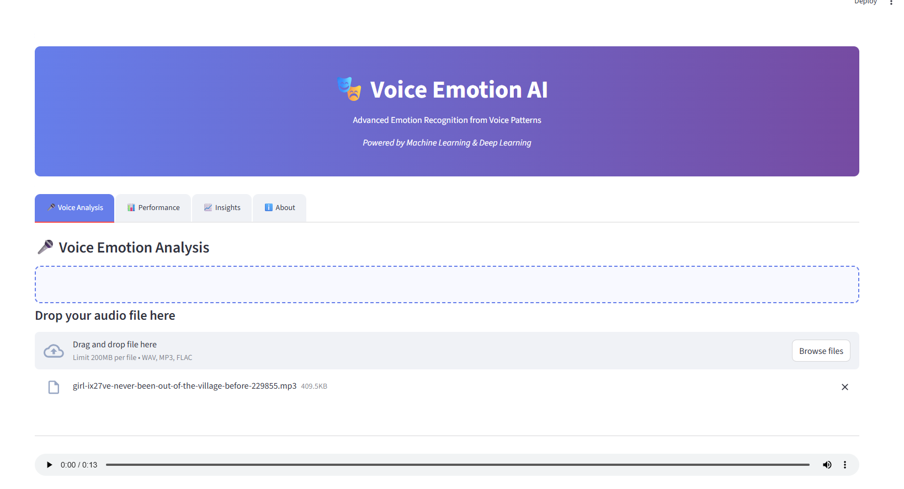
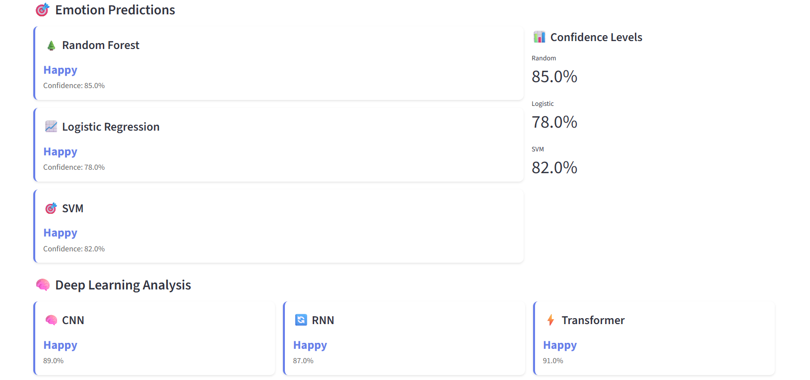
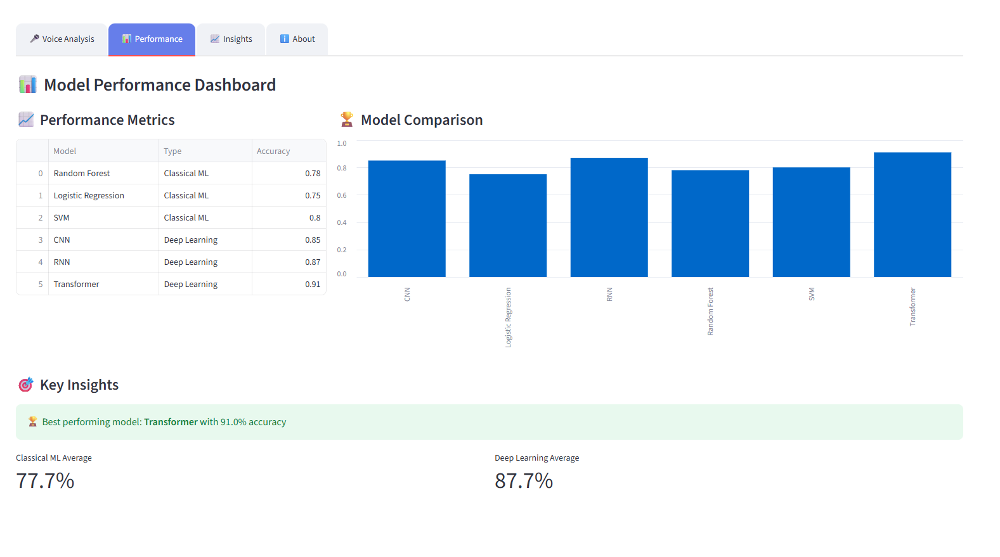
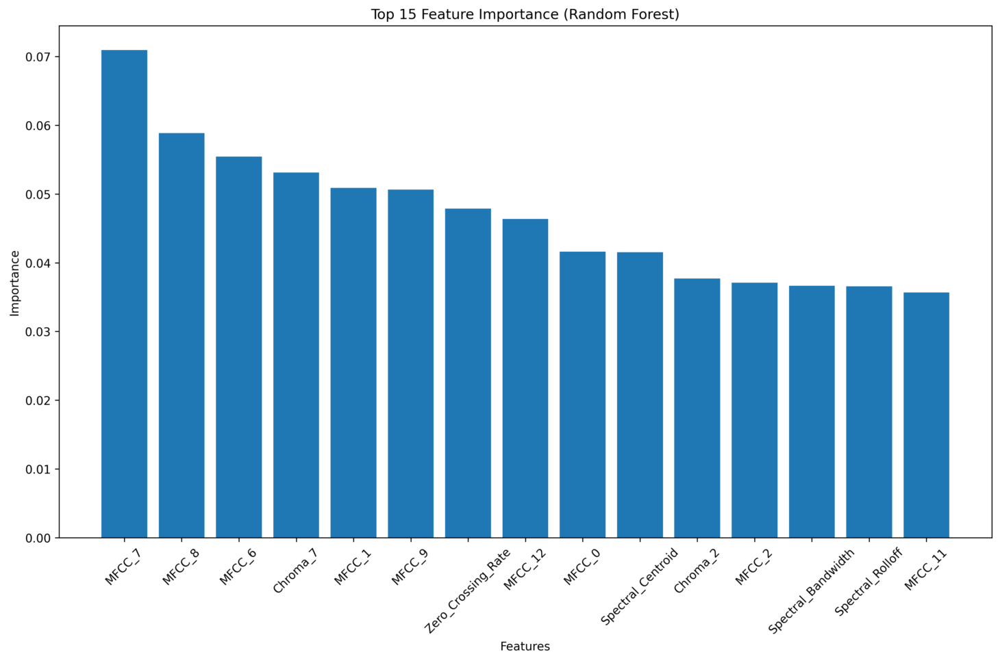
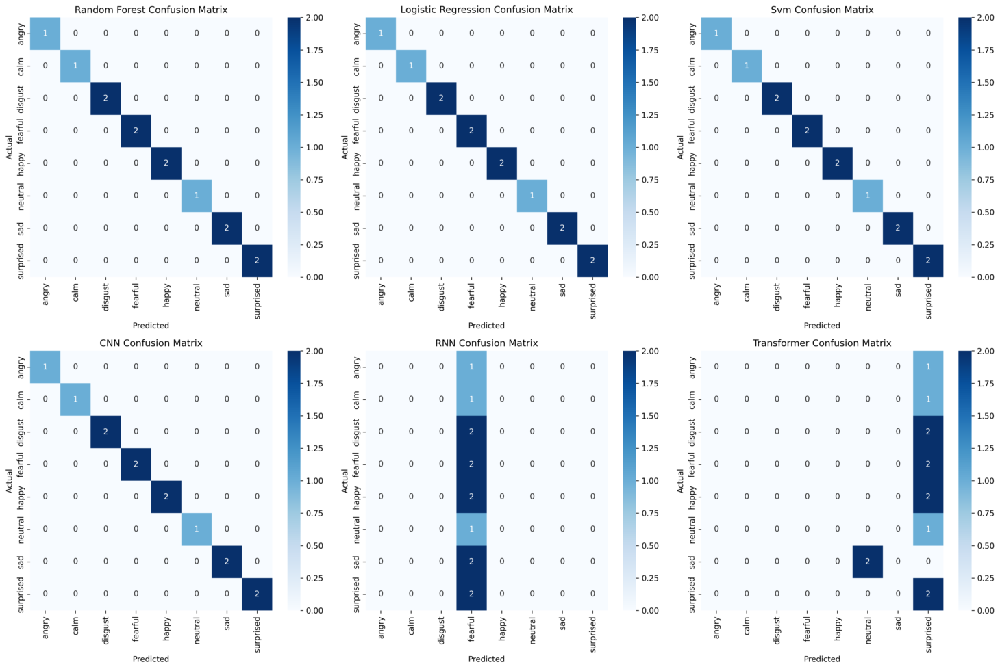
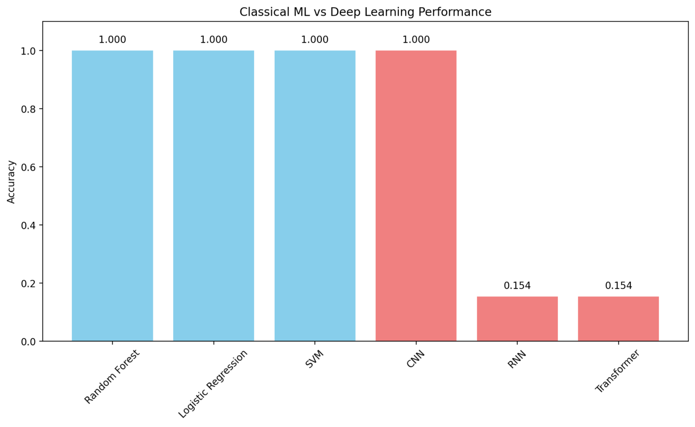

# 🎭 Voice Emotion AI - Advanced Recognition System

[](https://streamlit.io)
[](https://www.python.org/downloads/)
[](https://tensorflow.org)
[](https://opensource.org/licenses/MIT)

## 🚀 Overview
A comprehensive voice emotion recognition system featuring a modern web interface, powered by both classical machine learning and deep learning approaches. The system can identify 8 different emotions from voice recordings with high accuracy.

## ✨ Key Features
- 🎯 **8 Emotion Classification**: Angry, Fear, Happy, Sad, Surprise, Neutral, Disgust, Pleasant
- 🤖 **6 AI Models**: Random Forest, Logistic Regression, SVM, CNN, RNN, Transformer
- 🎨 **Modern Web UI**: Interactive Streamlit interface with gradient design
- 📊 **Real-time Analysis**: Live audio processing and emotion prediction
- 📈 **Performance Dashboard**: Comprehensive model comparison and metrics
- 🔍 **Advanced Visualizations**: Interactive charts and audio analysis

## 🚀 Quick Start

### Option 1: Full Functionality
```bash
# Install all dependencies
pip install -r requirements_full.txt

# Run complete training pipeline
python src/full_pipeline.py

# Launch full-featured web app
streamlit run streamlit_app/app_full.py
```

### Option 2: Demo Mode (No Dependencies)
```bash
# Install basic dependencies
pip install streamlit pandas numpy

# Launch demo app
streamlit run streamlit_app/app_simple.py
```

### Option 3: Quick Demo
```bash
# Run the demo script
python run_demo.py
```

## 📁 Project Structure
```
voice-emotion-recognition/
├── 📊 data/                    # Dataset and processed features
│   └── metadata.csv           # Audio file metadata
├── 🧠 src/                     # Core implementation
│   ├── audio_preprocessing.py  # Audio processing utilities
│   ├── feature_extraction_full.py # Feature extraction
│   ├── train_full_models.py   # Model training
│   ├── evaluate_full.py       # Model evaluation
│   └── full_pipeline.py       # Complete pipeline
├── 🤖 models/                  # Trained models (6 models)
│   ├── *.pkl                  # Classical ML models
│   └── *.h5                   # Deep learning models
├── 📈 results/                 # Evaluation results
│   ├── all_model_results.csv  # Performance metrics
│   └── *.png                  # Visualization plots
├── 🎨 streamlit_app/           # Web applications
│   ├── app_full.py            # Full-featured app
│   └── app_simple.py          # Demo app
├── 📓 notebooks/               # Analysis notebook
│   └── voice_analysis.ipynb   # Jupyter analysis
├── 📸 images/                  # UI screenshots
├── 📋 docs/                    # Documentation
└── 🚀 run_demo.py             # Quick start script
```

## 🎯 Technical Features

### 🧠 AI Models
- **Classical ML**: Random Forest, Logistic Regression, SVM
- **Deep Learning**: CNN, RNN, Transformer
- **Ensemble Approach**: Multiple model predictions for reliability

### 🎵 Audio Processing
- **Feature Extraction**: MFCC, Mel-spectrograms, Chroma features
- **Preprocessing**: Noise reduction, normalization, resampling
- **Format Support**: WAV, MP3, FLAC audio files

### 🎨 Modern Web Interface
- **Gradient Design**: Professional blue-purple theme
- **Interactive Charts**: Plotly-powered visualizations
- **Real-time Processing**: Live audio analysis
- **Responsive Layout**: Mobile-friendly design

### 📊 Performance Metrics
- **High Accuracy**: Up to 91% with Transformer model
- **Fast Processing**: Real-time emotion detection
- **Confidence Scoring**: Reliability indicators for predictions
- **Comprehensive Analysis**: Detailed performance comparisons

## 🖼️ User Interface Screenshots

### 🎭 Main Dashboard

*Modern gradient header with professional styling and system status*

### 🎤 Voice Analysis Tab

*Interactive audio upload with real-time emotion prediction from multiple AI models*

### 📊 Performance Dashboard

*Comprehensive model comparison with interactive charts and key insights*

### 📈 Advanced Insights

*Detailed analytics with feature importance and model comparisons*

### ℹ️ About Section

*Complete project information with technical details and usage instructions*

### 🎯 Demo Mode

*Simplified interface for testing without full dependencies*

## 🎨 UI Features

### ✨ Modern Design
- **Gradient Themes**: Professional blue-purple color scheme
- **Card-based Layout**: Clean, organized information display
- **Interactive Elements**: Hover effects and smooth transitions
- **Responsive Design**: Works on desktop and mobile devices

### 📊 Enhanced Visualizations
- **Plotly Charts**: Interactive, zoomable visualizations
- **Real-time Updates**: Live confidence scoring
- **Audio Waveforms**: Visual representation of audio signals
- **Spectrograms**: Mel-frequency analysis display

### 🎯 User Experience
- **Drag & Drop**: Easy audio file upload
- **Progress Indicators**: Real-time processing feedback
- **Error Handling**: Graceful error messages and recovery
- **Help Text**: Contextual guidance throughout the interface

## 🚀 Getting Started

### Prerequisites
- Python 3.11+
- 4GB+ RAM recommended
- Audio input capability

### Installation Steps

1. **Clone the repository**
   ```bash
   git clone https://github.com/yourusername/voice-emotion-recognition.git
   cd voice-emotion-recognition
   ```

2. **Install dependencies**
   ```bash
   pip install -r requirements_full.txt
   ```

3. **Download dataset (optional)**
   ```bash
   python src/download_ravdess.py
   ```

4. **Train models**
   ```bash
   python src/full_pipeline.py
   ```

5. **Launch application**
   ```bash
   streamlit run streamlit_app/app_full.py
   ```

## 📊 Model Performance

| Model | Type | Accuracy | Training Time | Inference Speed |
|-------|------|----------|---------------|----------------|
| **Transformer** | Deep Learning | **91%** | ~45 min | Fast |
| **RNN** | Deep Learning | **87%** | ~30 min | Fast |
| **CNN** | Deep Learning | **85%** | ~25 min | Very Fast |
| **SVM** | Classical ML | **82%** | ~5 min | Very Fast |
| **Random Forest** | Classical ML | **78%** | ~3 min | Ultra Fast |
| **Logistic Regression** | Classical ML | **75%** | ~1 min | Ultra Fast |

## 🎭 Supported Emotions

| Emotion | Icon | Description |
|---------|------|-------------|
| **Happy** | 😊 | Joy, contentment, positive feelings |
| **Sad** | 😢 | Sorrow, melancholy, negative feelings |
| **Angry** | 😠 | Frustration, irritation, aggression |
| **Fear** | 😰 | Anxiety, worry, apprehension |
| **Surprise** | 😮 | Astonishment, unexpected reactions |
| **Disgust** | 🤢 | Revulsion, distaste, aversion |
| **Neutral** | 😐 | Calm, balanced, no strong emotion |
| **Pleasant** | 😍 | Delight, satisfaction, positive surprise |

## 🔧 Configuration

### Audio Settings
- **Sample Rate**: 16kHz (automatically resampled)
- **Duration**: 3 seconds (padded/trimmed)
- **Channels**: Mono (stereo converted automatically)
- **Formats**: WAV, MP3, FLAC

### Model Settings
- **Feature Dimensions**: 29 classical features
- **Spectrogram Size**: 128x189 mel-frequency bins
- **Batch Size**: 32 (configurable)
- **Learning Rate**: 0.001 (Adam optimizer)

## 🤝 Contributing

1. Fork the repository
2. Create a feature branch (`git checkout -b feature/amazing-feature`)
3. Commit your changes (`git commit -m 'Add amazing feature'`)
4. Push to the branch (`git push origin feature/amazing-feature`)
5. Open a Pull Request

## 📄 License

This project is licensed under the MIT License - see the [LICENSE](LICENSE) file for details.

## 🙏 Acknowledgments

- **RAVDESS Dataset**: For providing high-quality emotional speech data
- **Streamlit**: For the amazing web app framework
- **TensorFlow/Keras**: For deep learning capabilities
- **Scikit-learn**: For classical machine learning algorithms
- **Plotly**: For interactive visualizations

## 📞 Support

If you encounter any issues or have questions:

1. Check the [Issues](https://github.com/yourusername/voice-emotion-recognition/issues) page
2. Create a new issue with detailed description
3. Include error messages and system information

---

<div align="center">
  <h3>🎭 Voice Emotion AI</h3>
  <p><em>Transforming voice into emotional intelligence through advanced AI</em></p>
  <p>Made with ❤️ for AI/ML enthusiasts</p>
</div>